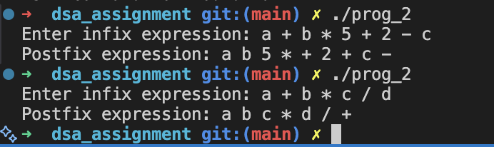

# Infix to Postfix Conversion

## Program Overview

This program reads a mathematical expression in infix notation from the user and converts it to postfix notation using a stack. It supports numbers, variables, parentheses `( )`, and basic arithmetic operators `+`, `-`, `*`, `/`.

Note: This version does not evaluate the expression; it only performs the conversion.

## Data Structures

### 1. Operator Stack

- Implemented as an array stack[MAX] with a top index.
- Used to temporarily hold operators and parentheses during conversion.

## Functions

### 1. push(char c)

Pushes a character onto the stack.

### 2. pop()

Removes and returns the top character from the stack. Returns `'\0'` if the stack is empty.

### 3. peek()

Returns the top element of the stack without removing it.

### 4. isEmpty()

Checks if the stack is empty; returns 1 if empty, else 0.

### 5. precedence(char c)

Returns the precedence of operators:

- `+` and `-` → 1
- `*` and `/` → 2

### 6. isOperator(char c)

Returns `1` if the character is an operator (`+ - * /`), else `0`.

### 7. infixToPostfix(char *infix, char *postfix)

Converts an infix expression to postfix using the following logic:

- Loop through each character in the infix expression.
- If the character is a number or variable, append it to the postfix string.
- If it is an opening parenthesis `(`, push it onto the stack.
- If it is a closing parenthesis `)`, pop from the stack until an opening parenthesis is found.
- If it is an operator, pop from the stack all operators with higher or equal precedence before pushing it.
- After reading the infix expression, pop any remaining operators from the stack to the postfix string.
- Spaces are added to separate numbers and variables for clarity.

### main() function

1. Prompts the user to enter an infix expression.
2. Calls`infixToPostfix() to convert it to postfix.
3. Prints the resulting postfix expression.

## Output

